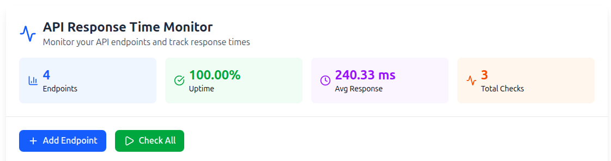
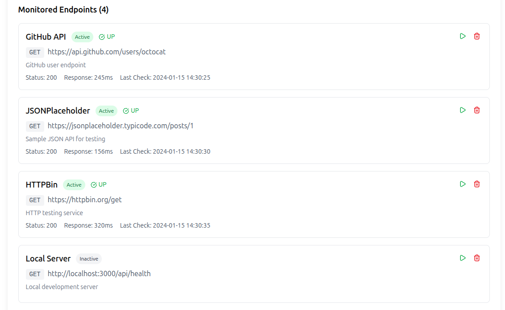
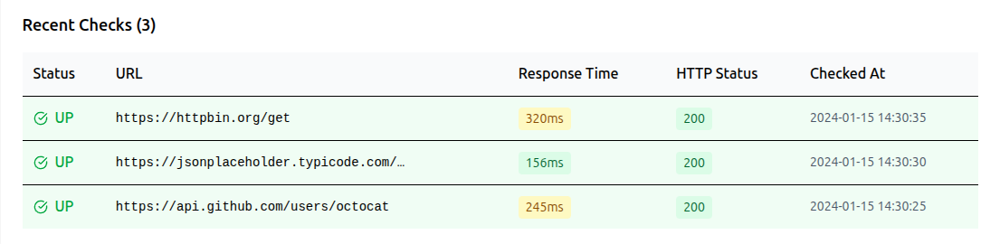

# API Response Time Monitor

A full-stack application for monitoring API endpoint health, tracking response times, and analyzing uptime statistics in real-time. Built with Go backend and React frontend.

## 📋 Table of Contents

- [Overview](#overview)
- [Features](#features)
- [Tech Stack](#tech-stack)
- [Project Structure](#project-structure)
- [Getting Started](#getting-started)
- [API Documentation](#api-documentation)
- [Usage](#usage)
- [Screenshots](#screenshots)
- [Contributing](#contributing)
- [License](#license)

## 🎯 Overview

API Response Time Monitor is a tool designed to help developers track the health and performance of their API endpoints. It performs real-time HTTP checks, measures response times, and provides comprehensive statistics including uptime percentages and average response times.

### Problem It Solves

- **Track API availability** during high-traffic events (e.g., result publication days, flash sales)
- **Monitor performance degradation** before it impacts users
- **Provide historical data** for incident reports and SLA compliance
- **Quick debugging** by identifying which API in a microservices architecture is failing

## ✨ Features

- ✅ **Real-time API Monitoring** - Check endpoint health on demand or schedule
- 📊 **Response Time Tracking** - Measure API response times in milliseconds
- 📈 **Statistics Dashboard** - View uptime percentages, average response times, and total checks
- 🎨 **Color-coded Status** - Visual indicators for fast (green), slow (yellow), and failed (red) responses
- 🔄 **Bulk Checks** - Monitor multiple endpoints simultaneously
- 📝 **Check History** - View past 20 checks with timestamps and status codes
- 🌐 **CORS Support** - Frontend-backend integration with proper CORS handling
- 🧪 **Sample Endpoints** - Pre-loaded with real API endpoints for immediate testing

## 🛠️ Tech Stack

### Backend
- **Go 1.21+** - High-performance backend server
- **net/http** - Built-in HTTP server and client
- **In-memory storage** - Fast data access for demo purposes

### Frontend
- **React 18.2+** - Modern UI framework
- **Tailwind CSS** - Utility-first CSS framework
- **Lucide React** - Beautiful icon library
- **Vite** - Fast build tool and development server

## 📁 Project Structure

```
api-monitor/
├── backend/
│   ├── cmd/
│   │   └── serve.go
│   ├── database/
│   │   └── in_memory_store.go
│   ├── handlers/
│   │   ├── api_endpoints.go
│   │   ├── api_checks.go
│   │   └── health.go
│   ├── middleware/
│   │   └── middleware.go
│   ├── models/
│   │   ├── api_endpoint.go
│   │   ├── api_check.go
│   │   └── response.go
│   ├── utils/
│   │   ├── response.go
│   │   └── helpers.go
│   ├── go.mod
│   └── main.go
│
└── frontend/
    ├── src/
    │   ├── components/
    │   │   ├── Dashboard/
    │   │   ├── Endpoints/
    │   │   ├── Checks/
    │   │   └── UI/
    │   ├── hooks/
    │   │   └── useAPIMonitor.js
    │   ├── services/
    │   │   └── api.js
    │   ├── utils/
    │   │   └── helpers.js
    │   ├── App.jsx
    │   └── main.jsx
    ├── package.json
    └── vite.config.js
```

## 🚀 Getting Started

### Prerequisites

- Go 1.21 or higher
- Node.js 18.x or higher
- npm or yarn

### Backend Setup

1. **Clone the repository**
   ```bash
   git clone https://github.com/yourusername/api-monitor.git
   cd api-monitor/backend
   ```

2. **Initialize Go module**
   ```bash
   go mod init github.com/yourusername/api-monitor
   go mod tidy
   ```

3. **Run the server**
   ```bash
   go run main.go
   ```

   The backend server will start on `http://localhost:8080`

### Frontend Setup

1. **Navigate to frontend directory**
   ```bash
   cd ../frontend
   ```

2. **Install dependencies**
   ```bash
   npm install
   ```

3. **Start development server**
   ```bash
   npm run dev
   ```

   The frontend will start on `http://localhost:5173`

## 📚 API Documentation

### Base URL
```
http://localhost:8080/api
```

### Endpoints

#### **Get All Endpoints**
```http
GET /api/endpoints
```
Returns list of all monitored endpoints.

#### **Create Endpoint**
```http
POST /api/endpoints
Content-Type: application/json

{
  "name": "GitHub API",
  "url": "https://api.github.com/users/github",
  "description": "GitHub user endpoint"
}
```

#### **Update Endpoint**
```http
PUT /api/endpoints/{id}
Content-Type: application/json

{
  "name": "Updated Name",
  "url": "https://api.example.com",
  "description": "Updated description",
  "is_active": true
}
```

#### **Delete Endpoint**
```http
DELETE /api/endpoints/{id}
```

#### **Get Check History**
```http
GET /api/checks?limit=20
```
Returns recent check results with optional limit.

#### **Run Check on Specific Endpoint**
```http
POST /api/checks/run/{endpoint_id}
```

#### **Run Check on All Active Endpoints**
```http
POST /api/checks/run-all
```

#### **Get Statistics**
```http
GET /api/stats
```
Returns monitoring statistics including uptime percentage and average response time.

#### **Health Check**
```http
GET /api/health
```
Returns service health status.

### Response Format

**Success Response:**
```json
{
  "id": 1,
  "url": "https://api.github.com/users/github",
  "response_time": 245,
  "status": 200,
  "checked_at": "2024-01-15 14:30:25",
  "is_up": true
}
```

**Statistics Response:**
```json
{
  "total_endpoints": 4,
  "active_endpoints": 3,
  "total_checks": 12,
  "successful_checks": 11,
  "failed_checks": 1,
  "avg_response_time": "287.45 ms",
  "uptime_percentage": "91.67%"
}
```

## 💻 Usage

### Adding a New Endpoint

1. Click the **"Add Endpoint"** button
2. Fill in the form:
   - **Name**: Descriptive name for the endpoint
   - **URL**: Full URL of the API endpoint
   - **Description**: Brief description of what it does
3. Click **"Add Endpoint"** to save

### Running Checks

- **Single Check**: Click the play (▶️) button next to any endpoint
- **All Checks**: Click the **"Check All"** button to test all active endpoints

### Viewing Results

- **Recent Checks Table**: Shows last 20 checks with color-coded status
- **Endpoint Cards**: Display latest check result for each endpoint
- **Statistics Dashboard**: View overall performance metrics

### Understanding Status Indicators

- 🟢 **Green**: Response time < 200ms (Fast)
- 🟡 **Yellow**: Response time 200-500ms (Moderate)
- 🔴 **Red**: Response time > 500ms or failed (Slow/Error)

## 📸 Screenshots

### Dashboard


### Add Endpoint


### Check Results


## 🧪 Testing with Sample Endpoints

The application comes pre-loaded with sample endpoints:

- **GitHub API**: `https://api.github.com/users/octocat`
- **JSONPlaceholder**: `https://jsonplaceholder.typicode.com/posts/1`
- **HTTPBin**: `https://httpbin.org/get`

You can also add these free public APIs for testing:

```bash
# Cat Facts API
curl -X POST http://localhost:8080/api/endpoints \
  -H "Content-Type: application/json" \
  -d '{"name":"Cat Facts","url":"https://catfact.ninja/fact","description":"Random cat facts"}'

# Dog API
curl -X POST http://localhost:8080/api/endpoints \
  -H "Content-Type: application/json" \
  -d '{"name":"Dog API","url":"https://dog.ceo/api/breeds/image/random","description":"Random dog images"}'
```

## 🔧 Configuration

### Backend Configuration

The backend server runs on port `8080` by default. To change:

```go
// main.go or cmd/serve.go
http.ListenAndServe(":YOUR_PORT", middleware.CorsMiddleware(mux))
```

### Frontend Configuration

Update the API base URL in `src/services/api.js`:

```javascript
const API_BASE_URL = 'http://localhost:8080/api';
```

## 🤝 Contributing

Contributions are welcome! Please follow these steps:

1. Fork the repository
2. Create a new branch (`git checkout -b feature/amazing-feature`)
3. Commit your changes (`git commit -m 'Add amazing feature'`)
4. Push to the branch (`git push origin feature/amazing-feature`)
5. Open a Pull Request

## 📝 License

This project is licensed under the MIT License - see the [LICENSE](LICENSE) file for details.

## 👨‍💻 Author

**Your Name**
- GitHub: [@yourusername](https://github.com/yourusername)
- LinkedIn: [Your LinkedIn](https://linkedin.com/in/yourprofile)
- Email: your.email@example.com

## 🙏 Acknowledgments

- Inspired by monitoring tools like Pingdom and StatusPage
- Built as a learning project to understand API monitoring patterns
- Sample APIs provided by JSONPlaceholder, GitHub, and HTTPBin

## 🔮 Future Enhancements

- [ ] Database persistence (PostgreSQL/MySQL)
- [ ] Scheduled monitoring with cron jobs
- [ ] Email/Slack notifications for downtime alerts
- [ ] Authentication and user management
- [ ] Custom check intervals per endpoint
- [ ] Response time charts and graphs
- [ ] Export reports to PDF/CSV
- [ ] Docker containerization
- [ ] CI/CD pipeline setup

## 📞 Support

For issues, questions, or suggestions, please open an issue on GitHub or contact me directly.

---

**⭐ If you find this project useful, please consider giving it a star!**
